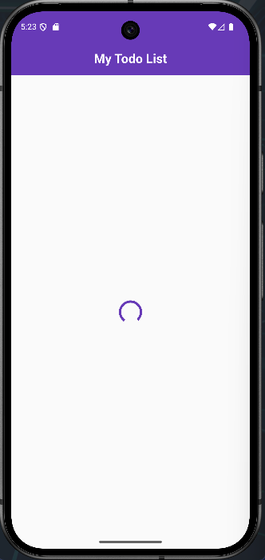
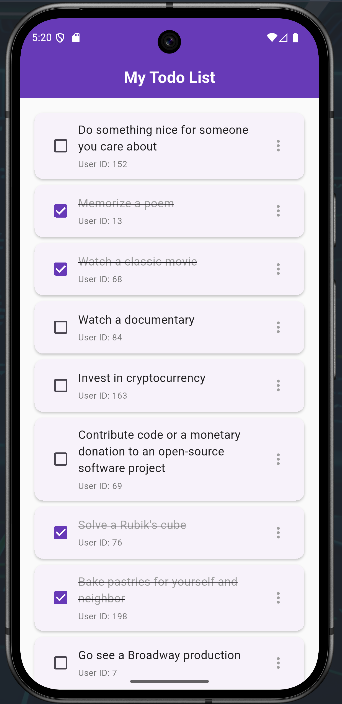
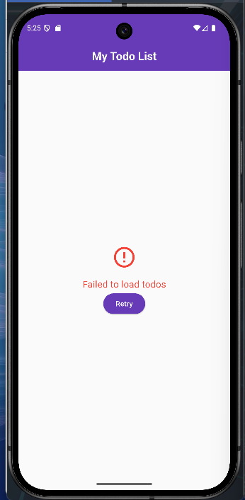

# Flutter Todo App with REST API


A beautiful Flutter application that fetches and displays todos from a REST API ([dummyjson.com](https://dummyjson.com/todos)) using modern UI elements including cards, pull-to-refresh, and error handling.

## Features

* 🎨 Material 3 UI design
* 🔄 Pull-to-refresh functionality
* ✅ Interactive todo items with checkboxes
* 🚦 Error handling with a retry button
* 🎯 State management via `setState`
* 🌈 Themed with deep purple accent color

## Screenshots

| Loading State                                   | Todo List                                    | Error State                                   |
| ----------------------------------------------- | -------------------------------------------- | --------------------------------------------- |
|  |  |  |

## API Overview

This app interacts with the [DummyJSON Todos API](https://dummyjson.com/todos) to fetch a list of sample todo items.

* **Endpoint:** `https://dummyjson.com/todos`


## Getting Started

### Prerequisites

* Flutter SDK (>=3.0.0)
* Dart (>=2.19.0)
* An IDE (Android Studio, VS Code, etc.)

### Installation

1. Clone the repository:

   ```bash
   git clone https://github.com/cybersleuth0/Todo_via_API.git
   ```
2. Navigate to the project directory:

   ```bash
   cd Todo_via_API
   ```
3. Install dependencies:

   ```bash
   flutter pub get
   ```
4. Run the app:

   ```bash
   flutter run
   ```

## Project Structure

```text
lib/
├── homepage.dart        # Main screen with todo list
├── main.dart            # App entry point
├── services/
│   └── api_service.dart # API interaction
└── model/
    └── todo_model.dart  # Data models for API response
```

## Dependencies

* [http](https://pub.dev/packages/http) – HTTP client for API requests
* [flutter](https://flutter.dev) – UI toolkit

---


  ```bash
  git init
  git add .
  git commit -m "Initial commit"
  git branch -M main
  git remote add origin https://github.com/cybersleuth0/Todo_via_API.git
  git push -u origin main
  ```
